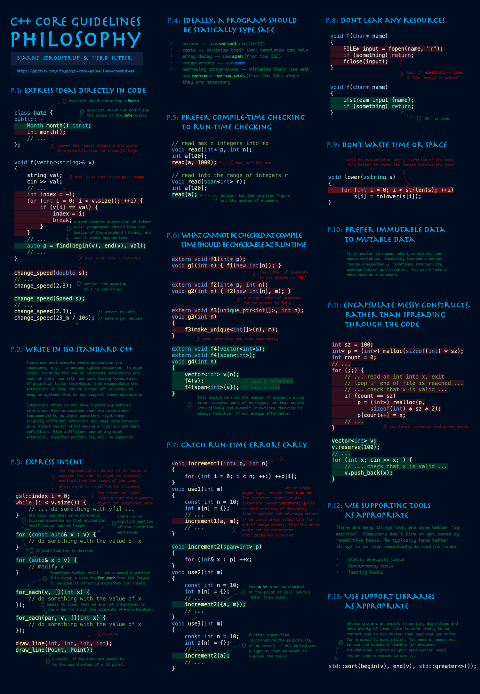

# C and CPP learning

This repository is used to document guidelines and relevant matetials on how to learn c and cpp programming.

Below is a concise guideline on how to program with cpp. *[Reference](https://github.com/ufoym/cpp-core-guidelines-cheatsheet)*

## IDE config

As the saying goes, to do a good job, an artisan needs the best tools. 

### VScode

The relevant configuration documentation can be found [here](./docs/config/vscode.md).

## Reference

- [cpp-core-guidelines-cheatsheet](https://github.com/ufoym/cpp-core-guidelines-cheatsheet)